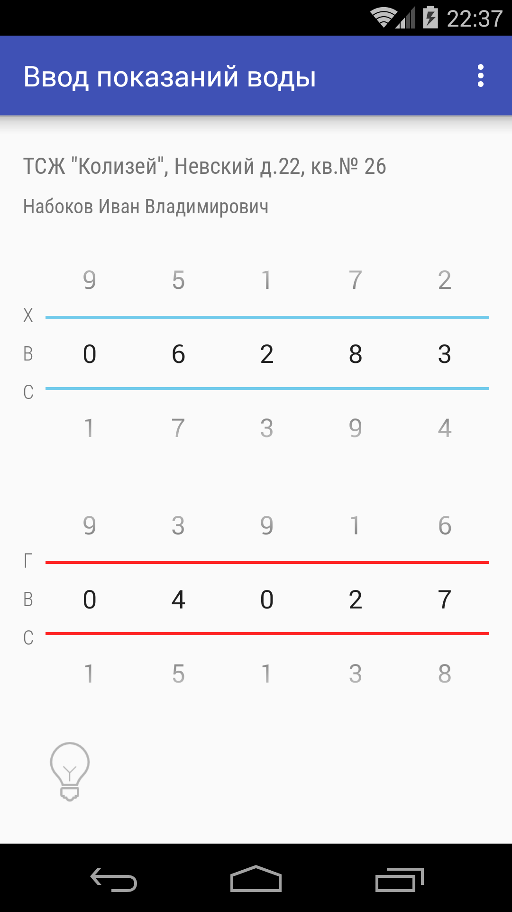

Ввод показаний счетчиков воды на портале «Кварта-С»
=========================

Программа для Android облегчает ввод показаний счетчиков воды на портале «Кварта-С»

Преимущества:
- всегда под рукой
- удобный интерфейс ввода показаний
- запоминает пароль
- возможность напоминания о необходимости сдать показания
- встроенный фонарик

